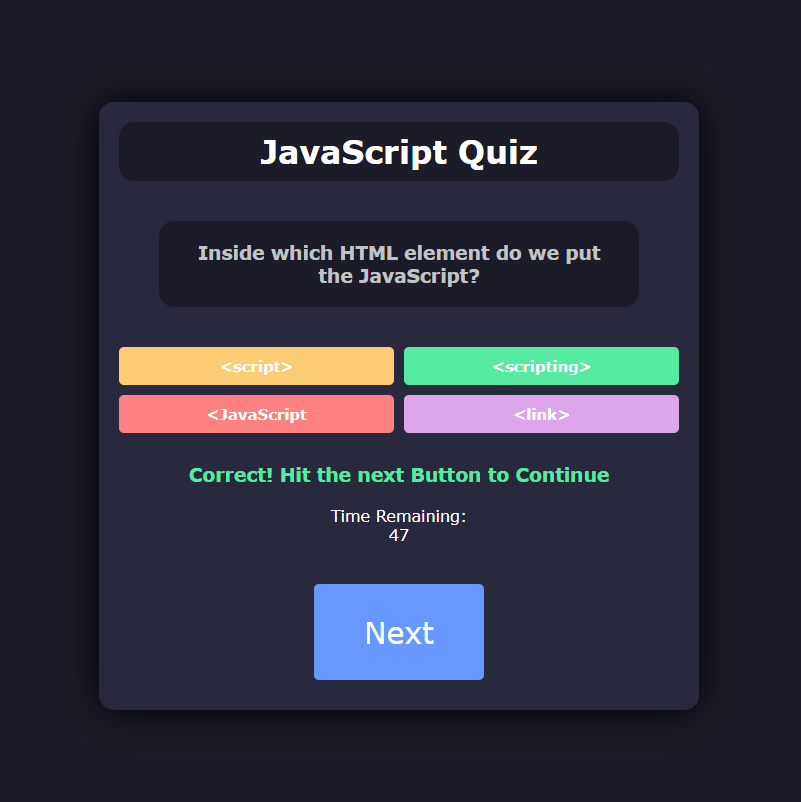
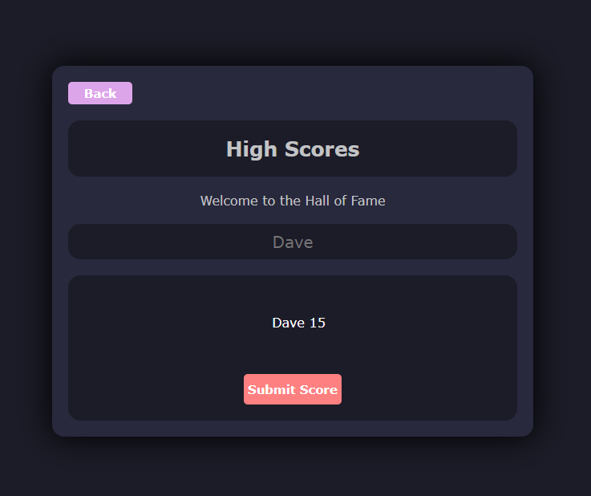

# JavaScript Code Quiz - README

## About This Project

#### The JavaScript Code Quiz was created for the sole purpose to educate and test all programmers of all levels of experience, while accomplishing this task in a fun and interactive way.

## How it works:

#### The program asks you a set of 5 questions and allows you to continue only after selecting the correct answer.
#### If you select from the wrong answers you will lose time and this will result in a lower score.
#### Your time remaining after the quiz is over will be the final score that is added onto your highscore along with your Name. Immortalize yourself in the locally stored hall of fame!

### Quiz - Answer Correct

### Quiz - Highscore Menu

## Motivation:

#### I wanted to create an application for testing little known fun facts and simple JavaScript questions to educate users of all knowledge and experience levels. The layout had to be interesting as well, with lots of fun colors while maintaining a 'dark mode' aesthetic for all my programmers out there browsing the web at the late hours of the night.

## Challenges:

#### It was very difficult to set up buttons that would change the layout of the page in order to display different windows such as the highscore page. Instead of creating separate html files with their own respective JavaScript files, I decided to add a class of "hide" to all of the containers I wanted to hide when proceeding to another phase of the application. And subsequently, I would remove the class whenever I needed to show an element
